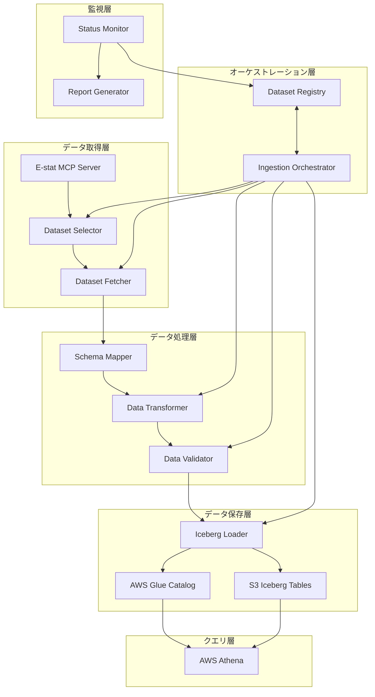

# 設計書: E-statデータレイク構築

## 概要

本設計書は、11のドメインカテゴリにわたる33のE-statデータセットを含む包括的なデータレイクの構築方法を定義します。システムは、既存のE-stat MCPサーバーツールを活用してデータを取得し、ドメイン固有のIcebergスキーマに変換し、AWS S3上のIcebergテーブルに保存します。データはAWS Athenaを通じてSQLクエリ可能になります。

### 主要な設計目標

1. **スケーラビリティ**: 33データセットから将来的により多くのデータセットへの拡張をサポート
2. **信頼性**: 堅牢なエラー処理とリカバリメカニズム
3. **保守性**: 明確なコンポーネント分離と設定駆動型アーキテクチャ
4. **パフォーマンス**: 並列処理とIcebergの最適化機能の活用
5. **監視性**: 包括的なロギングとステータス追跡

## アーキテクチャ

### システムアーキテクチャ図



### アーキテクチャの原則

1. **レイヤー分離**: データ取得、処理、保存、オーケストレーション、クエリの各層を明確に分離
2. **設定駆動**: ドメインスキーマ、データセット選択、S3パスなどを設定ファイルで管理
3. **冪等性**: 各パイプラインステージは再実行可能で、同じ結果を生成
4. **段階的処理**: fetch → transform → validate → load の明確なステージ
5. **メタデータ中心**: Dataset Registryがすべてのデータセットの状態を追跡

## コンポーネントとインターフェース

### 1. Dataset Selector（データセット選択器）

**責務**: 各ドメインに適切なE-statデータセットを特定して選択

**インターフェース**:
```python
class DatasetSelector:
    def search_datasets_for_domain(
        self, 
        domain: str, 
        keywords: List[str],
        min_datasets: int = 3
    ) -> List[DatasetInfo]:
        """
        ドメインのデータセットを検索
        
        Args:
            domain: ドメイン名 (population, economy, など)
            keywords: 検索キーワードのリスト
            min_datasets: 最小データセット数
            
        Returns:
            DatasetInfoオブジェクトのリスト
        """
        pass
    
    def select_datasets_for_all_domains(self) -> Dict[str, List[DatasetInfo]]:
        """
        すべてのドメインのデータセットを選択
        
        Returns:
            ドメイン名をキーとし、DatasetInfoリストを値とする辞書
        """
        pass
```

**実装の詳細**:
- E-stat MCP `search_estat_data` ツールを使用
- ドメインごとの検索キーワードを設定ファイルから読み込み
- データセットの新しさ、カバレッジ、更新頻度で優先順位付け
- 選択されたデータセットをDataset Registryに記録

### 2. Dataset Fetcher（データセット取得器）

**責務**: E-statからデータセットを取得してS3に保存

**インターフェース**:
```python
class DatasetFetcher:
    def fetch_dataset(
        self, 
        dataset_id: str,
        domain: str,
        retry_count: int = 3
    ) -> FetchResult:
        """
        データセットを取得
        
        Args:
            dataset_id: E-statデータセットID
            domain: ドメイン名
            retry_count: 再試行回数
            
        Returns:
            FetchResultオブジェクト（成功/失敗、S3パス、エラー情報）
        """
        pass
    
    def fetch_datasets_parallel(
        self,
        datasets: List[DatasetInfo],
        max_concurrent: int = 5
    ) -> List[FetchResult]:
        """
        複数のデータセットを並列取得
        
        Args:
            datasets: DatasetInfoオブジェクトのリスト
            max_concurrent: 最大同時実行数
            
        Returns:
            FetchResultオブジェクトのリスト
        """
        pass
```

**実装の詳細**:
- E-stat MCP `fetch_dataset_auto` ツールを使用（自動サイズ処理）
- 生データをS3に保存: `s3://estat-iceberg-datalake/raw/{domain}/{dataset_id}/`
- 指数バックオフによる再試行ロジック（1秒、2秒、4秒）
- Dataset Registryのステータスを更新（pending → in_progress → completed/failed）
- 並列処理にはPythonの`concurrent.futures.ThreadPoolExecutor`を使用

### 3. Schema Mapper（スキーママッパー）

**責務**: E-statデータ構造をドメイン固有のIcebergスキーマにマッピング

**インターフェース**:
```python
class SchemaMapper:
    def infer_domain(self, metadata: Dict[str, Any]) -> str:
        """メタデータからドメインを推論"""
        pass
    
    def get_schema(self, domain: str) -> Dict[str, Any]:
        """ドメインのスキーマ定義を取得"""
        pass
    
    def map_estat_to_iceberg(
        self,
        estat_record: Dict[str, Any],
        domain: str,
        dataset_id: str
    ) -> Dict[str, Any]:
        """E-statレコードをIcebergレコードにマッピング"""
        pass
```

**実装の詳細**:
- 既存の`datalake/schema_mapper.py`を活用
- 11のドメインスキーマ定義を使用
- キーワードベースのドメイン推論ロジック
- フィールドマッピングルール:
  - 時間フィールド → year, quarter, month
  - 地域フィールド → region_code, region_name
  - カテゴリフィールド → ドメイン固有のカテゴリ列
  - 値フィールド → value (DOUBLE型)
  - 単位フィールド → unit (STRING型)

### 4. Data Transformer（データ変換器）

**責務**: 生データをIceberg形式に変換してParquetで保存

**インターフェース**:
```python
class DataTransformer:
    def transform_dataset(
        self,
        raw_s3_path: str,
        dataset_id: str,
        domain: str
    ) -> TransformResult:
        """
        データセットを変換
        
        Args:
            raw_s3_path: 生データのS3パス
            dataset_id: データセットID
            domain: ドメイン名
            
        Returns:
            TransformResultオブジェクト（成功/失敗、出力パス、統計情報）
        """
        pass
    
    def transform_datasets_parallel(
        self,
        datasets: List[DatasetInfo],
        max_concurrent: int = 5
    ) -> List[TransformResult]:
        """複数のデータセットを並列変換"""
        pass
```

**実装の詳細**:
- E-stat MCP `transform_data` ツールを使用
- Schema Mapperを使用してレコードをマッピング
- 変換されたデータをParquet形式で保存: `s3://estat-iceberg-datalake/transformed/{domain}/{dataset_id}/`
- マッピング不可能なフィールドの処理:
  - 警告をログに記録
  - 重要でないフィールドは除外
  - 重要なフィールドにはデフォルト値を適用
- Dataset Registryを更新（transformation_date、output_location）

### 5. Data Validator（データ検証器）

**責務**: データ品質を検証してIcebergテーブルへのロード前に問題を検出

**インターフェース**:
```python
class DataValidator:
    def validate_dataset(
        self,
        transformed_s3_path: str,
        dataset_id: str,
        domain: str,
        check_duplicates: bool = True
    ) -> ValidationResult:
        """
        データセットを検証
        
        Args:
            transformed_s3_path: 変換されたデータのS3パス
            dataset_id: データセットID
            domain: ドメイン名
            check_duplicates: 重複チェックを実行するか
            
        Returns:
            ValidationResultオブジェクト（合格/不合格、問題レポート）
        """
        pass
```

**実装の詳細**:
- E-stat MCP `validate_data_quality` ツールを使用
- 検証チェック:
  1. **必須フィールドチェック**: ドメインスキーマで定義された必須フィールドの存在確認
  2. **データ型チェック**: 各フィールドの型がスキーマ仕様と一致することを確認
  3. **重複チェック**: ドメイン固有の主キー定義に基づく重複レコードの検出
  4. **値範囲チェック**: 数値フィールドの妥当な範囲確認
- 検証レポート生成:
  - カテゴリ別の問題カウント
  - サンプルエラーレコード
  - 全体の合格/不合格率
- 失敗基準: 検証失敗率が10%を超える場合、データセットを不合格とする

### 6. Iceberg Loader（Icebergローダー）

**責務**: 検証済みデータをドメイン固有のIcebergテーブルにロード

**インターフェース**:
```python
class IcebergLoader:
    def load_dataset(
        self,
        transformed_s3_path: str,
        dataset_id: str,
        domain: str,
        create_if_not_exists: bool = True
    ) -> LoadResult:
        """
        データセットをIcebergテーブルにロード
        
        Args:
            transformed_s3_path: 変換されたデータのS3パス
            dataset_id: データセットID
            domain: ドメイン名
            create_if_not_exists: テーブルが存在しない場合に作成するか
            
        Returns:
            LoadResultオブジェクト（成功/失敗、レコード数、メタデータ）
        """
        pass
    
    def create_iceberg_table(self, domain: str) -> bool:
        """ドメインのIcebergテーブルを作成"""
        pass
```

**実装の詳細**:
- E-stat MCP `load_to_iceberg` ツールを使用
- テーブル作成ロジック:
  - Glue Catalogでテーブルの存在を確認
  - 存在しない場合、ドメインスキーマに基づいてテーブルを作成
  - テーブル場所: `s3://estat-iceberg-datalake/iceberg/{domain}/`
- データロード:
  - 追加モード（APPEND）を使用
  - Icebergのトランザクション機能を活用
  - 失敗時のロールバック
- メタデータ更新:
  - レコード数
  - パーティション情報
  - 最終更新タイムスタンプ
- Dataset Registryを更新（load_date、record_count、status）

### 7. Ingestion Orchestrator（取り込みオーケストレーター）

**責務**: 33データセットの完全な取り込みパイプラインを調整

**インターフェース**:
```python
class IngestionOrchestrator:
    def ingest_all_datasets(
        self,
        max_concurrent: int = 5,
        resume_from_failure: bool = True
    ) -> IngestionReport:
        """
        すべてのデータセットを取り込む
        
        Args:
            max_concurrent: 最大同時実行数
            resume_from_failure: 失敗から再開するか
            
        Returns:
            IngestionReportオブジェクト（サマリー、詳細、エラー）
        """
        pass
    
    def ingest_dataset(
        self,
        dataset_id: str,
        domain: str
    ) -> DatasetIngestionResult:
        """単一のデータセットを取り込む"""
        pass
    
    def resume_failed_datasets(self) -> IngestionReport:
        """失敗したデータセットを再処理"""
        pass
```

**実装の詳細**:
- パイプラインステージ: fetch → transform → validate → load
- 並列処理戦略:
  - `concurrent.futures.ThreadPoolExecutor`を使用
  - デフォルトの同時実行数: 5
  - ドメインごとにグループ化して処理
- エラー処理:
  - 各ステージでの失敗を記録
  - 失敗したデータセットをスキップして続行
  - 完了時に失敗サマリーを報告
- 再開ロジック:
  - Dataset Registryから最後に成功したステージを読み取り
  - 次のステージから再開
  - 部分的なアーティファクトをクリーンアップ
- 進捗追跡:
  - リアルタイムステータスダッシュボード
  - ステージごとの完了カウント
  - 推定残り時間

### 8. Dataset Registry（データセットレジストリ）

**責務**: すべてのデータセットのメタデータとステータスを追跡

**データモデル**:
```yaml
datasets:
  - id: "0003458339"
    name: "人口推計（令和2年国勢調査基準）"
    domain: "population"
    status: "completed"  # pending, in_progress, completed, failed
    priority: 10
    added_at: "2024-01-19T00:00:00"
    updated_at: "2024-01-19T12:00:00"
    fetch_date: "2024-01-19T10:00:00"
    transformation_date: "2024-01-19T10:30:00"
    validation_date: "2024-01-19T11:00:00"
    load_date: "2024-01-19T11:30:00"
    record_count: 150000
    raw_s3_path: "s3://estat-iceberg-datalake/raw/population/0003458339/"
    transformed_s3_path: "s3://estat-iceberg-datalake/transformed/population/0003458339/"
    status_history:
      - from: "pending"
        to: "in_progress"
        timestamp: "2024-01-19T10:00:00"
      - from: "in_progress"
        to: "completed"
        timestamp: "2024-01-19T11:30:00"
```

**インターフェース**:
```python
class DatasetRegistry:
    def add_dataset(self, dataset_info: DatasetInfo) -> None:
        """データセットを追加"""
        pass
    
    def update_status(
        self,
        dataset_id: str,
        new_status: str,
        metadata: Dict[str, Any] = None
    ) -> None:
        """データセットのステータスを更新"""
        pass
    
    def get_datasets_by_domain(self, domain: str) -> List[DatasetInfo]:
        """ドメインのデータセットを取得"""
        pass
    
    def get_datasets_by_status(self, status: str) -> List[DatasetInfo]:
        """ステータスでデータセットをフィルタ"""
        pass
    
    def persist_to_s3(self) -> None:
        """レジストリをS3に永続化"""
        pass
```

**実装の詳細**:
- YAMLファイル形式（`datalake/config/dataset_config.yaml`）
- 各更新後にS3に永続化
- ステータス履歴の追跡
- ドメイン、ステータス、日付範囲によるクエリサポート

### 9. Status Monitor（ステータスモニター）

**責務**: データレイクの健全性と進捗を監視

**インターフェース**:
```python
class StatusMonitor:
    def get_ingestion_progress(self) -> ProgressReport:
        """取り込み進捗を取得"""
        pass
    
    def get_domain_summary(self) -> Dict[str, DomainStats]:
        """ドメイン別のサマリーを取得"""
        pass
    
    def check_dataset_freshness(self) -> List[FreshnessAlert]:
        """データセットの鮮度をチェック"""
        pass
```

**実装の詳細**:
- Dataset Registryからリアルタイムステータスを読み取り
- ダッシュボードビュー:
  - ドメイン別の進捗バー
  - 成功/失敗カウント
  - 推定完了時間
- アラート:
  - ドメインあたり3データセット未満
  - 検証失敗率が高い
  - 長時間実行中のジョブ

### 10. Report Generator（レポート生成器）

**責務**: 取り込み完了レポートとデータレイクサマリーを生成

**インターフェース**:
```python
class ReportGenerator:
    def generate_ingestion_report(self) -> IngestionReport:
        """取り込み完了レポートを生成"""
        pass
    
    def generate_datalake_summary(self) -> DatalakeSummary:
        """データレイクサマリーを生成"""
        pass
    
    def generate_domain_report(self, domain: str) -> DomainReport:
        """ドメイン別レポートを生成"""
        pass
```

**実装の詳細**:
- レポート内容:
  - 合計データセット数、レコード数、ストレージサイズ
  - ドメイン別の統計
  - 処理時間とパフォーマンスメトリクス
  - データ品質メトリクス
  - エラーサマリー
- 出力形式: JSON、Markdown、HTML
- S3への保存: `s3://estat-iceberg-datalake/reports/`

## データモデル

### DatasetInfo

```python
@dataclass
class DatasetInfo:
    id: str
    name: str
    domain: str
    status: str  # pending, in_progress, completed, failed
    priority: int
    added_at: datetime
    updated_at: datetime
    fetch_date: Optional[datetime] = None
    transformation_date: Optional[datetime] = None
    validation_date: Optional[datetime] = None
    load_date: Optional[datetime] = None
    record_count: Optional[int] = None
    raw_s3_path: Optional[str] = None
    transformed_s3_path: Optional[str] = None
    error_message: Optional[str] = None
```

### FetchResult

```python
@dataclass
class FetchResult:
    dataset_id: str
    success: bool
    s3_path: Optional[str] = None
    error_message: Optional[str] = None
    fetch_time: float = 0.0
    record_count: int = 0
```

### TransformResult

```python
@dataclass
class TransformResult:
    dataset_id: str
    success: bool
    output_s3_path: Optional[str] = None
    error_message: Optional[str] = None
    transform_time: float = 0.0
    input_record_count: int = 0
    output_record_count: int = 0
    unmapped_fields: List[str] = field(default_factory=list)
```

### ValidationResult

```python
@dataclass
class ValidationResult:
    dataset_id: str
    passed: bool
    total_records: int
    failed_records: int
    failure_rate: float
    issues: Dict[str, int]  # カテゴリ別の問題カウント
    sample_errors: List[Dict[str, Any]]
    validation_time: float = 0.0
```

### LoadResult

```python
@dataclass
class LoadResult:
    dataset_id: str
    success: bool
    table_name: str
    record_count: int
    error_message: Optional[str] = None
    load_time: float = 0.0
```

### IngestionReport

```python
@dataclass
class IngestionReport:
    total_datasets: int
    successful_datasets: int
    failed_datasets: int
    total_records: int
    total_time: float
    domain_stats: Dict[str, DomainStats]
    failed_dataset_details: List[DatasetInfo]
    performance_metrics: Dict[str, float]
```

## 正確性プロパティ

*プロパティとは、システムのすべての有効な実行において真であるべき特性または動作です。本質的には、システムが何をすべきかについての形式的な記述です。プロパティは、人間が読める仕様と機械で検証可能な正確性保証の橋渡しとなります。*


### データセット選択プロパティ

**プロパティ1: ドメイン関連キーワードによる検索**
*任意の*ドメインに対して、データセット検索時にそのドメインに関連するキーワードがMCP検索ツールに渡されるべきである
**検証: 要件 1.1**

**プロパティ2: ドメインごとの最小データセット数**
*任意の*ドメインに対して、データセット選択プロセス完了後、そのドメインには少なくとも3つのデータセット（または利用可能な最大数）が割り当てられるべきである
**検証: 要件 1.2**

**プロパティ3: データセット優先順位付け**
*任意の*データセットリストに対して、優先順位付け関数は、より新しいデータ、より包括的なカバレッジ、より頻繁な更新を持つデータセットをより高くランク付けするべきである
**検証: 要件 1.3**

**プロパティ4: レジストリへの完全な記録**
*任意の*選択されたデータセットに対して、Dataset_Registryエントリには、dataset_id、dataset_name、domain、selection_rationaleフィールドが含まれるべきである
**検証: 要件 1.4**

### データセット取得プロパティ

**プロパティ5: サイズベースのツール選択**
*任意の*データセットに対して、そのサイズに基づいて適切なMCP取得ツール（fetch_dataset_autoなど）が選択されるべきである
**検証: 要件 2.1**

**プロパティ6: S3パス形式の一貫性**
*任意の*ドメインとdataset_idに対して、生成されるS3パスは形式`s3://estat-iceberg-datalake/raw/{domain}/{dataset_id}/`に従うべきである
**検証: 要件 2.2**

**プロパティ7: 指数バックオフによる再試行**
*任意の*取得失敗に対して、システムは指数バックオフ（1秒、2秒、4秒）で最大3回再試行し、各試行をログに記録するべきである
**検証: 要件 2.3**

**プロパティ8: 取得ステータスの追跡**
*任意の*データセットに対して、取得プロセス中にDataset_Registryのステータスがpending → in_progress → completed/failedの順に更新されるべきである
**検証: 要件 2.4**

### データ変換プロパティ

**プロパティ9: ドメイン推論の正確性**
*任意の*データセットメタデータに対して、Schema_Mapperは定義されたキーワードマッピングに基づいて正しいドメインを推論するべきである
**検証: 要件 3.1**

**プロパティ10: スキーママッピングの一貫性**
*任意の*E-statレコードとドメインに対して、変換後のレコードはそのドメインのIcebergスキーマ定義に従うべきである
**検証: 要件 3.2**

**プロパティ11: Parquet出力パスの形式**
*任意の*ドメインとdataset_idに対して、変換されたデータのS3パスは形式`s3://estat-iceberg-datalake/transformed/{domain}/{dataset_id}/`に従い、Parquet形式であるべきである
**検証: 要件 3.4**

**プロパティ12: 変換後のレジストリ更新**
*任意の*データセットに対して、変換完了後、Dataset_Registryにはtransformation_dateとtransformed_s3_pathが記録されるべきである
**検証: 要件 3.5**

### データ検証プロパティ

**プロパティ13: 必須フィールドの検証**
*任意の*データセットとドメインに対して、検証プロセスはドメインスキーマで定義されたすべての必須フィールドの存在をチェックするべきである
**検証: 要件 4.1**

**プロパティ14: データ型の検証**
*任意の*レコードとドメインスキーマに対して、各フィールドのデータ型がスキーマ仕様と一致することが検証されるべきである
**検証: 要件 4.2**

**プロパティ15: 重複レコードの検出**
*任意の*データセットに対して、ドメイン固有の主キー定義に基づいて重複レコードが識別されるべきである
**検証: 要件 4.3**

**プロパティ16: 検証レポートの完全性**
*任意の*検証プロセスに対して、問題が検出された場合、レポートにはカテゴリ別の問題カウント（missing_fields、type_mismatches、duplicates）が含まれるべきである
**検証: 要件 4.4**

**プロパティ17: 検証失敗の閾値**
*任意の*データセットに対して、検証失敗率が10%を超える場合、データセットはfailedステータスとしてマークされ、ロードが防止されるべきである
**検証: 要件 4.5**

### Icebergロードプロパティ

**プロパティ18: データの追加モードロード**
*任意の*検証済みデータセットに対して、データは追加モード（APPEND）を使用してIcebergテーブルにロードされ、既存のデータを上書きしないべきである
**検証: 要件 5.2**

**プロパティ19: ロード後のメタデータ更新**
*任意の*データセットに対して、ロード完了後、Icebergテーブルメタデータにはrecord_countとpartition_informationが含まれるべきである
**検証: 要件 5.3**

**プロパティ20: Glue Catalogへの登録**
*任意の*ドメインテーブルに対して、テーブルの場所`s3://estat-iceberg-datalake/iceberg/{domain}/`がGlue_Catalogに登録されるべきである
**検証: 要件 5.4**

**プロパティ21: ロード失敗時のロールバック**
*任意の*ロード操作に対して、失敗が発生した場合、トランザクションがロールバックされ、テーブルの一貫性が維持されるべきである
**検証: 要件 5.5**

### パイプラインオーケストレーションプロパティ

**プロパティ22: パイプラインステージの順序**
*任意の*データセットに対して、取り込みパイプラインのステージはfetch → transform → validate → loadの順序で実行されるべきである
**検証: 要件 6.1**

**プロパティ23: 並列実行の制限**
*任意の*時点において、同時に実行されているデータセット処理の数は設定された制限（デフォルト: 5）を超えないべきである
**検証: 要件 6.2**

**プロパティ24: 進捗ステータスの追跡**
*任意の*時点において、取り込みステータスダッシュボードは33のすべてのデータセットの現在のステータスと進捗を正確に反映するべきである
**検証: 要件 6.3**

**プロパティ25: 失敗の分離**
*任意の*データセットの失敗に対して、他のデータセットの処理は継続され、すべての失敗は最終レポートに記録されるべきである
**検証: 要件 6.4**

**プロパティ26: 最終レポートの完全性**
*任意の*取り込み実行に対して、最終レポートにはsuccess_count、failure_count、processing_times、domain_stats、error_summariesが含まれるべきである
**検証: 要件 6.5**

### レジストリ管理プロパティ

**プロパティ27: レジストリの完全性と整合性**
*任意の*時点において、Dataset_Registryには33のすべてのデータセットのエントリが含まれ、各エントリにはdataset_id、dataset_name、domain、status、added_at、updated_atフィールドが含まれるべきである
**検証: 要件 7.1, 7.2**

**プロパティ28: ステージ完了後の更新**
*任意の*パイプラインステージ完了に対して、Dataset_Registryは対応するタイムスタンプフィールド（fetch_date、transformation_date、validation_date、load_date）で更新されるべきである
**検証: 要件 7.3**

**プロパティ29: S3への永続化**
*任意の*Dataset_Registry更新に対して、更新されたレジストリはS3に永続化され、耐久性が保証されるべきである
**検証: 要件 7.4**

**プロパティ30: レジストリクエリのフィルタリング**
*任意の*クエリに対して、Dataset_Registryはdomain、status、date_rangeによるフィルタリングをサポートするべきである
**検証: 要件 7.5**

### エラー処理とリカバリプロパティ

**プロパティ31: ネットワークエラーの再試行**
*任意の*ネットワークエラーに対して、システムは指数バックオフ（1秒、2秒、4秒）で再試行し、各試行をログに記録するべきである
**検証: 要件 9.1**

**プロパティ32: 検証失敗時のデータ保持**
*任意の*検証失敗に対して、生データと変換されたデータの両方がS3に保持され、手動検査が可能であるべきである
**検証: 要件 9.2**

**プロパティ33: 最後に成功したステージからの再開**
*任意の*失敗したデータセットに対して、再処理時にDataset_Registryから最後に成功したステージが読み取られ、次のステージから再開されるべきである
**検証: 要件 9.3**

**プロパティ34: 再処理前のクリーンアップ**
*任意の*再処理に対して、以前の試行からの部分的なアーティファクト（不完全なファイル、一時データ）がクリーンアップされるべきである
**検証: 要件 9.4**

**プロパティ35: エラーログの完全性**
*任意の*エラーに対して、エラーログにはtimestamp、dataset_id、stage_name、error_messageが含まれるべきである
**検証: 要件 9.5**

### 監視とレポートプロパティ

**プロパティ36: データレイクサマリーの完全性**
*任意の*データレイクサマリーレポートに対して、total_datasets、total_records、storage_size_by_domainが含まれるべきである
**検証: 要件 10.1**

**プロパティ37: 完了レポートの完全性**
*任意の*取り込み完了レポートに対して、processing_times、success_rates、data_quality_metricsが含まれるべきである
**検証: 要件 10.2**

**プロパティ38: ストレージコストの追跡**
*任意の*ドメインに対して、S3ストレージコストがデータ量に基づいて正確に計算され、追跡されるべきである
**検証: 要件 10.3**

**プロパティ39: データセット鮮度の計算**
*任意の*データセットに対して、鮮度（最終更新からの日数）が正確に計算され、ダッシュボードに表示されるべきである
**検証: 要件 10.4**

**プロパティ40: データセット数のアラート**
*任意の*ドメインに対して、データセット数が3未満の場合、アラートが生成されるべきである
**検証: 要件 10.5**

## エラー処理

### エラーカテゴリ

1. **ネットワークエラー**
   - E-stat APIの一時的な利用不可
   - S3接続の問題
   - 処理: 指数バックオフによる再試行（1秒、2秒、4秒）
   - 最大再試行回数: 3回

2. **データ品質エラー**
   - 必須フィールドの欠落
   - データ型の不一致
   - 重複レコード
   - 処理: 検証レポートを生成し、失敗率が10%を超える場合はデータセットを拒否

3. **スキーママッピングエラー**
   - マッピング不可能なフィールド
   - 不明なドメイン
   - 処理: 警告をログに記録し、デフォルト値を適用または除外

4. **Icebergロードエラー**
   - テーブル作成の失敗
   - トランザクションの失敗
   - 処理: ロールバックしてテーブルの一貫性を維持

5. **設定エラー**
   - 無効なドメイン名
   - 欠落している設定パラメータ
   - 処理: 起動時に検証し、明確なエラーメッセージで失敗

### エラーログ形式

```json
{
  "timestamp": "2024-01-19T10:30:00Z",
  "dataset_id": "0003458339",
  "domain": "population",
  "stage": "fetch",
  "error_type": "NetworkError",
  "error_message": "Connection timeout to E-stat API",
  "retry_count": 2,
  "stack_trace": "..."
}
```

### リカバリ戦略

1. **自動リカバリ**
   - ネットワークエラー: 指数バックオフによる自動再試行
   - 一時的なS3エラー: 自動再試行

2. **手動介入が必要**
   - データ品質エラー: ソースデータの修正が必要
   - スキーママッピングエラー: スキーマ定義の更新が必要
   - 設定エラー: 設定ファイルの修正が必要

3. **部分的リカバリ**
   - 失敗したデータセットのみを再処理
   - 最後に成功したステージから再開
   - 部分的なアーティファクトをクリーンアップ

## テスト戦略

### デュアルテストアプローチ

本プロジェクトでは、包括的なカバレッジを確保するために、ユニットテストとプロパティベーステストの両方を使用します:

- **ユニットテスト**: 特定の例、エッジケース、エラー条件を検証
- **プロパティテスト**: すべての入力にわたる普遍的なプロパティを検証
- 両方が補完的で、包括的なカバレッジに必要

### ユニットテストのバランス

- ユニットテストは特定の例とエッジケースに役立つ
- 多くのユニットテストを書きすぎないようにする - プロパティベーステストが多くの入力をカバー
- ユニットテストは以下に焦点を当てる:
  - 正しい動作を示す特定の例
  - コンポーネント間の統合ポイント
  - エッジケースとエラー条件
- プロパティテストは以下に焦点を当てる:
  - すべての入力に対して成り立つ普遍的なプロパティ
  - ランダム化による包括的な入力カバレッジ

### プロパティベーステスト設定

- **テストライブラリ**: Python用のHypothesis
- **最小イテレーション数**: プロパティテストごとに100回（ランダム化のため）
- **タグ形式**: `# Feature: estat-data-lake, Property {number}: {property_text}`
- **実装ルール**: 各正確性プロパティは単一のプロパティベーステストで実装される

### テストカバレッジ

1. **データセット選択テスト**
   - ユニット: 特定のドメインキーワードマッピング
   - プロパティ: すべてのドメインが最小データセット数を持つ（プロパティ2）

2. **データ取得テスト**
   - ユニット: 特定のS3パス生成例
   - プロパティ: すべてのドメイン/IDの組み合わせで正しいパス形式（プロパティ6）

3. **スキーママッピングテスト**
   - ユニット: 特定のドメイン推論例
   - プロパティ: すべてのメタデータで正しいドメイン推論（プロパティ9）

4. **データ検証テスト**
   - ユニット: 特定の検証失敗例
   - プロパティ: すべてのデータセットで必須フィールドチェック（プロパティ13）

5. **Icebergロードテスト**
   - ユニット: 特定のロールバックシナリオ
   - プロパティ: すべてのロード失敗でロールバック（プロパティ21）

6. **オーケストレーションテスト**
   - ユニット: 特定のパイプライン実行例
   - プロパティ: すべてのデータセットで正しいステージ順序（プロパティ22）

7. **エラー処理テスト**
   - ユニット: 特定のエラーシナリオ
   - プロパティ: すべてのネットワークエラーで再試行（プロパティ31）

### 統合テスト

- エンドツーエンドのパイプライン実行
- 小規模なテストデータセット（各ドメイン1つ）を使用
- すべてのコンポーネントの統合を検証
- Athenaクエリ機能を検証

### パフォーマンステスト

- 33データセットの完全な取り込み時間を測定
- 並列処理のスケーラビリティを検証
- Athenaクエリのパフォーマンスを測定
- S3ストレージコストを追跡
