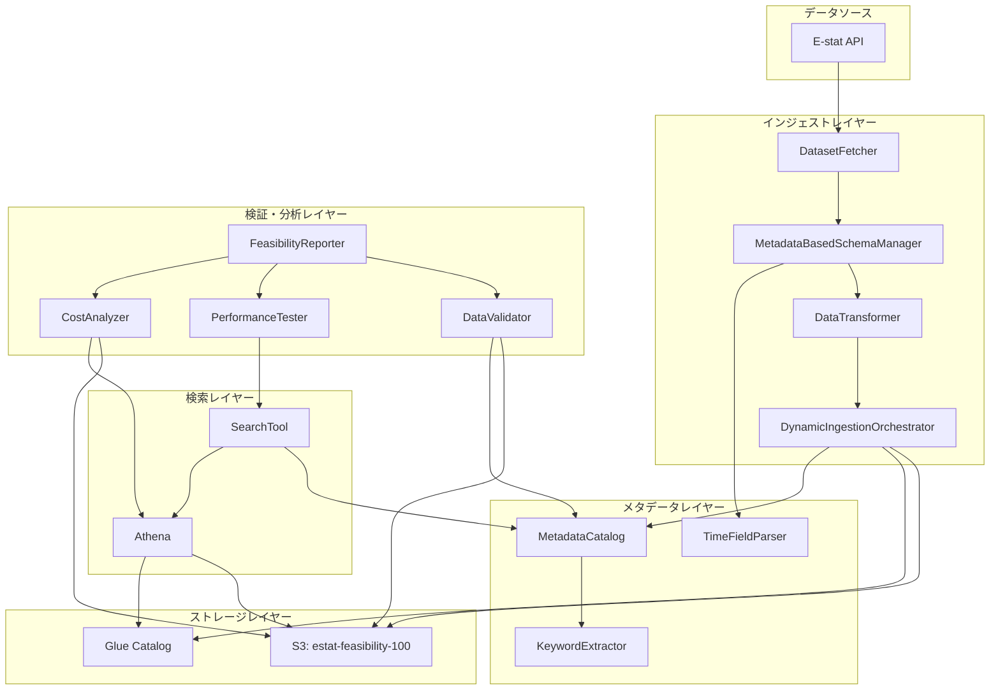

# 設計書

## 概要

本設計書は、100件のE-statデータセットに限定したIcebergレイクハウスのフィージビリティスタディの技術設計を定義します。既存の実装（MetadataBasedSchemaManager、DynamicIngestionOrchestrator、MetadataCatalog、KeywordExtractor、TimeFieldParser）を活用し、15-22日間で実装可能な最小限の機能セットを提供します。

### 設計目標

1. **既存コンポーネントの再利用**: 実証済みのコンポーネントを最大限活用し、開発時間を短縮
2. **スケーラビリティの検証**: 100件で検証し、1,000件、10,000件へのスケーラビリティを評価
3. **パフォーマンス検証**: メタデータ検索100ms以内、Athenaクエリ5秒以内を達成
4. **コスト透明性**: 実際のコストを測定し、大規模展開のコストを予測
5. **運用可能性の評価**: メンテナンス、モニタリング、トラブルシューティングの容易さを評価

## アーキテクチャ

### システム構成図



### レイヤー構成

1. **インジェストレイヤー**: E-statからデータを取得し、Iceberg形式に変換
2. **ストレージレイヤー**: S3にIcebergテーブルを保存、Glue Catalogにメタデータを登録
3. **メタデータレイヤー**: 検索可能なメタデータカタログを管理
4. **検索レイヤー**: ハイブリッド検索（メタデータ + Athena）を提供
5. **検証・分析レイヤー**: データ品質、パフォーマンス、コストを検証

## コンポーネントとインターフェース

### 1. インフラストラクチャセットアップ

#### InfrastructureProvisioner

**責務**: AWSリソースの作成と検証

**インターフェース**:
```python
class InfrastructureProvisioner:
    def create_s3_bucket(self, bucket_name: str) -> bool:
        """S3バケットを作成"""
        
    def create_glue_database(self, database_name: str) -> bool:
        """Glue Catalogデータベースを作成"""
        
    def configure_iam_roles(self) -> bool:
        """IAMロールとポリシーを設定"""
        
    def configure_athena_workgroup(self, workgroup_name: str, result_location: str) -> bool:
        """Athenaワークグループを設定"""
        
    def validate_infrastructure(self) -> Dict[str, bool]:
        """すべてのコンポーネントが正しく設定されているか検証"""
        
    def teardown_infrastructure(self) -> bool:
        """すべてのリソースを削除"""
```

**設計決定**:
- AWS CLIまたはBoto3を使用してプログラマティックに作成
- 冪等性を確保（既存リソースがある場合はスキップ）
- 検証ステップで各コンポーネントの接続性を確認

### 2. データインジェスト

#### FeasibilityIngestionOrchestrator

**責務**: 100件のデータセットのインジェストをオーケストレート

**インターフェース**:
```python
class FeasibilityIngestionOrchestrator:
    def __init__(
        self,
        schema_manager: MetadataBasedSchemaManager,
        orchestrator: DynamicIngestionOrchestrator,
        catalog: MetadataCatalog,
        max_datasets: int = 100
    ):
        """既存コンポーネントを統合"""
        
    def select_datasets(self) -> List[str]:
        """E-statから100件のデータセットを選択
        
        選択基準:
        - 多様なドメイン（人口、労働、経済、教育など）
        - 多様なサイズ（小、中、大）
        - 時間フィールドを持つデータセット優先
        """
        
    def ingest_all_datasets(self) -> IngestionReport:
        """100件すべてのデータセットを取り込む
        
        Returns:
            成功数、失敗数、エラー詳細を含むレポート
        """
        
    def ingest_single_dataset(self, dataset_id: str) -> IngestionResult:
        """単一データセットを取り込む
        
        Steps:
        1. E-stat APIからメタデータとデータを取得
        2. MetadataBasedSchemaManagerでスキーマを推論
        3. TimeFieldParserで時間フィールドを識別
        4. Iceberg形式に変換（時間フィールドでパーティション）
        5. S3に保存、Glue Catalogに登録
        6. MetadataCatalogにメタデータを保存
        """
```

**設計決定**:
- 既存のDynamicIngestionOrchestratorをラップして100件制限を追加
- エラーハンドリング: 1件失敗しても残りを継続
- パーティション戦略: 時間フィールドのみ（地域フィールドは除外）
- ログ: 各データセットの処理状況を詳細に記録

### 3. メタデータ管理

#### 既存コンポーネントの活用

**MetadataCatalog** (既存):
- データセットメタデータの保存と検索
- タイトル、説明、ドメイン、カラム名、時間範囲を管理

**KeywordExtractor** (既存):
- 日本語キーワードの自動抽出
- ドメイン知識ベースのキーワード展開

**TimeFieldParser** (既存):
- 時間フィールドの自動識別
- 時間範囲の抽出

**拡張が必要な機能**:
```python
class EnhancedMetadataCatalog(MetadataCatalog):
    def store_schema_info(self, dataset_id: str, schema: Dict) -> None:
        """推論されたスキーマ情報を保存"""
        
    def search_with_filters(
        self,
        query: str,
        domain_filter: Optional[str] = None,
        time_range_filter: Optional[Tuple[str, str]] = None
    ) -> List[DatasetMetadata]:
        """フィルタ付き検索"""
```

### 4. 検索ツール

#### SearchTool

**責務**: 日本語自然言語クエリによるハイブリッド検索

**インターフェース**:
```python
class SearchTool:
    def __init__(
        self,
        catalog: MetadataCatalog,
        keyword_extractor: KeywordExtractor,
        athena_client: AthenaClient
    ):
        """既存コンポーネントを統合"""
        
    def search(
        self,
        query: str,
        domain_filter: Optional[str] = None,
        time_range_filter: Optional[Tuple[str, str]] = None,
        use_athena: bool = False
    ) -> SearchResult:
        """ハイブリッド検索を実行
        
        Steps:
        1. KeywordExtractorでクエリからキーワードを抽出・展開
        2. MetadataCatalogでメタデータ検索
        3. use_athena=Trueの場合、Athenaでデータ内容も検索
        4. 結果をランク付けして返す
        """
        
    def rank_results(self, results: List[DatasetMetadata], query: str) -> List[DatasetMetadata]:
        """検索結果を関連性でランク付け
        
        ランキング要素:
        - タイトルマッチ（高）
        - 説明マッチ（中）
        - キーワードマッチ（中）
        - カラム名マッチ（低）
        """
        
    def suggest_alternatives(self, query: str) -> List[str]:
        """結果が見つからない場合の代替キーワード提案"""
```

**設計決定**:
- デフォルトはメタデータのみ検索（高速）
- Athena検索はオプション（詳細検索用）
- ランキングアルゴリズム: TF-IDFベースのシンプルなスコアリング
- 代替提案: KeywordExtractorの同義語辞書を活用

### 5. パフォーマンステスト

#### PerformanceTester

**責務**: 検索とクエリのパフォーマンスを測定

**インターフェース**:
```python
class PerformanceTester:
    def test_metadata_search_performance(self, num_queries: int = 100) -> PerformanceMetrics:
        """メタデータ検索のパフォーマンスを測定
        
        Returns:
            p50, p95, p99レイテンシ
        """
        
    def test_athena_query_performance(self, queries: List[str]) -> PerformanceMetrics:
        """Athenaクエリのパフォーマンスを測定"""
        
    def test_concurrent_access(self, num_users: int = 10) -> PerformanceMetrics:
        """同時アクセスのパフォーマンスを測定"""
        
    def generate_test_queries(self) -> List[str]:
        """テスト用クエリを生成
        
        - 実際のユースケースを反映
        - 多様なキーワード（人口、労働、経済など）
        - 多様な複雑さ（単純、複雑）
        """
```

**設計決定**:
- 100件のクエリで統計的に有意な測定
- パーセンタイル（p50, p95, p99）で評価
- 同時アクセステスト: 10ユーザーで十分（フィージビリティレベル）

### 6. コスト分析

#### CostAnalyzer

**責務**: 実際のコストを測定し、大規模展開のコストを予測

**インターフェース**:
```python
class CostAnalyzer:
    def measure_s3_storage_cost(self) -> float:
        """S3ストレージコストを測定
        
        - バケットサイズを取得
        - リージョンの料金を適用
        """
        
    def measure_athena_query_cost(self, queries: List[str]) -> float:
        """Athenaクエリコストを測定
        
        - スキャンされたデータ量を記録
        - クエリ数と料金を計算
        """
        
    def measure_data_transfer_cost(self) -> float:
        """データ転送コストを測定"""
        
    def project_costs(self, scale: int) -> CostProjection:
        """大規模展開のコストを予測
        
        Args:
            scale: データセット数（1000 or 10000）
            
        Returns:
            ストレージ、コンピュート、転送の予測コスト
        """
```

**設計決定**:
- AWS Cost Explorerまたは直接計算
- 線形スケーリングを仮定（保守的な見積もり）
- 月次コストで表示

### 7. データ品質検証

#### DataQualityValidator

**責務**: インジェスト後のデータ品質を検証

**インターフェース**:
```python
class DataQualityValidator:
    def validate_row_counts(self, dataset_id: str) -> ValidationResult:
        """行数がソースデータと一致するか検証"""
        
    def validate_schema(self, dataset_id: str) -> ValidationResult:
        """スキーマが推論されたスキーマと一致するか検証"""
        
    def validate_null_values(self, dataset_id: str) -> ValidationResult:
        """必須フィールドにnull値がないか検証"""
        
    def validate_partitions(self, dataset_id: str) -> ValidationResult:
        """パーティションが正しく作成されているか検証"""
        
    def generate_validation_report(self) -> ValidationReport:
        """すべてのデータセットの検証結果をまとめたレポート"""
```

### 8. フィージビリティレポート

#### FeasibilityReporter

**責務**: 包括的なフィージビリティレポートを生成

**インターフェース**:
```python
class FeasibilityReporter:
    def __init__(
        self,
        validator: DataQualityValidator,
        perf_tester: PerformanceTester,
        cost_analyzer: CostAnalyzer
    ):
        """検証コンポーネントを統合"""
        
    def generate_report(self) -> FeasibilityReport:
        """包括的なレポートを生成
        
        セクション:
        1. エグゼクティブサマリー
        2. 技術的実現可能性
        3. パフォーマンス評価
        4. コスト分析
        5. スケーラビリティ評価
        6. 運用上の考慮事項
        7. 推奨事項
        8. リスクと緩和策
        """
```

## データモデル

### Icebergテーブルスキーマ

各データセットは独自のスキーマを持ちます（Dynamic Schema）:

```python
# 例: 人口統計データセット
{
    "dataset_id": "string",
    "time_field": "string",  # 例: "2020年", "2021Q1"
    "area_code": "string",
    "area_name": "string",
    "value_1": "double",
    "value_2": "double",
    # ... データセット固有のカラム
}
```

**パーティション戦略**:
- `time_field`でパーティション分割
- 年、四半期、月などの粒度は自動検出

### メタデータカタログスキーマ

```python
{
    "dataset_id": "string",
    "title": "string",
    "description": "string",
    "domain": "string",  # 例: "population", "labor", "economy"
    "keywords": ["string"],  # 抽出されたキーワード
    "columns": [
        {
            "name": "string",
            "type": "string",
            "description": "string"
        }
    ],
    "time_range": {
        "start": "string",
        "end": "string"
    },
    "row_count": "integer",
    "file_size": "integer",
    "s3_location": "string",
    "glue_table_name": "string",
    "ingestion_timestamp": "timestamp",
    "schema_version": "string"
}
```

### パフォーマンスメトリクス

```python
{
    "test_type": "string",  # "metadata_search", "athena_query", "concurrent"
    "num_queries": "integer",
    "p50_latency_ms": "float",
    "p95_latency_ms": "float",
    "p99_latency_ms": "float",
    "avg_latency_ms": "float",
    "max_latency_ms": "float",
    "timestamp": "timestamp"
}
```

### コスト分析

```python
{
    "period": "string",  # "daily", "monthly"
    "s3_storage_cost": "float",
    "athena_query_cost": "float",
    "data_transfer_cost": "float",
    "total_cost": "float",
    "num_datasets": "integer",
    "projections": {
        "1000_datasets": {
            "storage": "float",
            "compute": "float",
            "transfer": "float",
            "total": "float"
        },
        "10000_datasets": {
            "storage": "float",
            "compute": "float",
            "transfer": "float",
            "total": "float"
        }
    }
}
```


## 正確性プロパティ

プロパティとは、システムのすべての有効な実行において真であるべき特性または動作です。本質的には、システムが何をすべきかについての形式的な記述です。プロパティは、人間が読める仕様と機械で検証可能な正確性保証との橋渡しとなります。

### プロパティリフレクション

事前分析を確認した結果、以下の冗長性を特定しました:

1. **インジェストの完全性**: 2.1（100件取得）、2.5（すべてGlue Catalogに登録）、3.1（すべてメタデータ保存）は、インジェストパイプラインの完全性を検証する包括的なプロパティに統合できます。

2. **メタデータの完全性**: 3.2（必須フィールド）、3.3（キーワード）、3.4（スキーマ）は、メタデータエントリの完全性を検証する単一のプロパティに統合できます。

3. **検証の完全性**: 8.1（行数）、8.2（スキーマ）、8.3（null値）、8.4（パーティション）は、データ品質検証の包括的なプロパティに統合できます。

4. **レポートの完全性**: 7.1-7.7は、フィージビリティレポートの完全性を検証する単一のプロパティに統合できます。

### プロパティ一覧

#### プロパティ1: インフラストラクチャコンポーネントのアクセス可能性

*すべての*作成されたインフラストラクチャコンポーネント（S3バケット、Glue Catalog、IAMロール、Athenaワークグループ）について、それらは作成後にアクセス可能で機能的でなければならない

**検証: 要件 1.3, 1.5**

#### プロパティ2: インジェストパイプラインの完全性

*すべての*インジェスト実行について、取得されたデータセット数、Glue Catalogに登録されたテーブル数、MetadataCatalogに保存されたメタデータエントリ数は等しくなければならない（最大100件）

**検証: 要件 2.1, 2.5, 3.1**

#### プロパティ3: Iceberg形式への変換

*すべての*取得されたデータセットについて、それらはIceberg形式に変換され、S3に保存されなければならない

**検証: 要件 2.3**

#### プロパティ4: 時間フィールドパーティショニング

*すべての*時間フィールドを持つデータセットについて、それらは時間フィールドでパーティション分割されなければならない

**検証: 要件 2.4**

#### プロパティ5: エラー耐性

*任意の*データセットのインジェストが失敗した場合でも、残りのデータセットの処理は継続されなければならない

**検証: 要件 2.7**

#### プロパティ6: インジェストログの完全性

*すべての*処理されたデータセットについて、インジェストログにエントリが存在しなければならない（成功または失敗）

**検証: 要件 2.6**

#### プロパティ7: メタデータエントリの完全性

*すべての*MetadataCatalogに保存されたメタデータエントリについて、それらはタイトル、説明、ドメイン、カラム名、時間範囲、キーワード、スキーマ情報を含まなければならない

**検証: 要件 3.2, 3.3, 3.4**

#### プロパティ8: メタデータ検索機能

*すべての*検索タイプ（タイトル、説明、ドメイン、キーワード）について、MetadataCatalogは関連する結果を返さなければならない

**検証: 要件 3.5**

#### プロパティ9: メタデータフィルタリング機能

*すべての*フィルタ条件（時間範囲、ドメイン）について、MetadataCatalogはフィルタに一致する結果のみを返さなければならない

**検証: 要件 3.6**

#### プロパティ10: 日本語クエリ処理

*すべての*日本語自然言語クエリについて、Search_Toolはクエリを処理し、結果を返さなければならない

**検証: 要件 4.1**

#### プロパティ11: キーワード展開

*すべての*検索クエリについて、Search_Toolはドメイン知識を使用してキーワードを展開しなければならない

**検証: 要件 4.2**

#### プロパティ12: ハイブリッド検索

*すべての*ハイブリッド検索リクエストについて、Search_ToolはメタデータカタログとオプションでAthenaの両方から結果を取得しなければならない

**検証: 要件 4.3**

#### プロパティ13: 検索結果のランキング

*すべての*検索結果について、それらは関連性スコアでランク付けされなければならない

**検証: 要件 4.4**

#### プロパティ14: メタデータ検索パフォーマンス

*すべての*メタデータのみの検索について、応答時間は100ミリ秒以内でなければならない（p95）

**検証: 要件 4.5**

#### プロパティ15: 検索フィルタリングオプション

*すべての*検索リクエストについて、ドメイン、時間範囲、データ特性によるフィルタリングオプションが利用可能でなければならない

**検証: 要件 4.6**

#### プロパティ16: 代替提案

*すべての*結果が見つからない検索について、Search_Toolは代替キーワードまたは関連データセットを提案しなければならない

**検証: 要件 4.7**

#### プロパティ17: パフォーマンスメトリクスの完全性

*すべての*パフォーマンステスト実行について、記録されたメトリクスはp50、p95、p99のレイテンシを含まなければならない

**検証: 要件 5.4**

#### プロパティ18: コスト予測の完全性

*すべての*コスト予測について、それらはストレージ、コンピュート、データ転送のコンポーネントを含まなければならない

**検証: 要件 6.5**

#### プロパティ19: フィージビリティレポートの完全性

*すべての*フィージビリティレポートについて、それらは技術的実現可能性、パフォーマンスメトリクス、コスト分析、スケーラビリティ評価、運用上の考慮事項、推奨事項を含まなければならない

**検証: 要件 7.1, 7.2, 7.3, 7.4, 7.5, 7.6**

#### プロパティ20: 問題発生時の緩和策

*任意の*技術的またはコスト上の問題が特定された場合、フィージビリティレポートは緩和戦略を文書化しなければならない

**検証: 要件 7.7**

#### プロパティ21: データ品質検証の完全性

*すべての*インジェストされたデータセットについて、行数の一致、スキーマの正確性、必須フィールドのnull値チェック、パーティションの正確性が検証されなければならない

**検証: 要件 8.1, 8.2, 8.3, 8.4**

#### プロパティ22: 検証エラーレポート

*すべての*検証失敗について、レポートはデータセット識別子と特定の問題を含まなければならない

**検証: 要件 8.5**

#### プロパティ23: 既存コンポーネントのインターフェース保持

*すべての*既存コンポーネント（MetadataBasedSchemaManager、DynamicIngestionOrchestrator、MetadataCatalog、KeywordExtractor、TimeFieldParser）について、それらの既存のインターフェースと動作は統合後も維持されなければならない

**検証: 要件 9.6**

#### プロパティ24: インフラストラクチャ作成の検証

*すべての*インフラストラクチャ作成操作について、各コンポーネントの作成が成功したことが検証されなければならない

**検証: 要件 10.3**

#### プロパティ25: インフラストラクチャ削除の完全性

*すべての*インフラストラクチャ削除操作について、すべてのAWSリソースが削除されなければならない

**検証: 要件 10.4**

## エラーハンドリング

### エラーカテゴリ

1. **インフラストラクチャエラー**
   - S3バケット作成失敗
   - Glue Catalog作成失敗
   - IAMロール設定失敗
   - Athenaワークグループ設定失敗

2. **インジェストエラー**
   - E-stat API接続エラー
   - データ取得エラー
   - スキーマ推論エラー
   - Iceberg変換エラー
   - S3アップロードエラー
   - Glue Catalog登録エラー

3. **検索エラー**
   - メタデータカタログクエリエラー
   - Athenaクエリエラー
   - キーワード展開エラー

4. **検証エラー**
   - データ品質検証エラー
   - パフォーマンステストエラー
   - コスト分析エラー

### エラーハンドリング戦略

#### 1. インフラストラクチャエラー

```python
try:
    provisioner.create_s3_bucket("estat-feasibility-100")
except BucketAlreadyExistsError:
    logger.warning("Bucket already exists, skipping creation")
except InsufficientPermissionsError as e:
    logger.error(f"Insufficient permissions: {e}")
    raise FatalError("Cannot proceed without proper permissions")
except Exception as e:
    logger.error(f"Unexpected error creating bucket: {e}")
    raise
```

**戦略**: 
- 冪等性を確保（既存リソースはスキップ）
- 権限エラーは致命的（処理を停止）
- その他のエラーは再試行可能

#### 2. インジェストエラー

```python
for dataset_id in dataset_ids:
    try:
        result = orchestrator.ingest_single_dataset(dataset_id)
        logger.info(f"Successfully ingested {dataset_id}")
    except EstatAPIError as e:
        logger.error(f"E-stat API error for {dataset_id}: {e}")
        failed_datasets.append((dataset_id, str(e)))
        continue  # 残りを継続
    except SchemaInferenceError as e:
        logger.error(f"Schema inference failed for {dataset_id}: {e}")
        failed_datasets.append((dataset_id, str(e)))
        continue
    except Exception as e:
        logger.error(f"Unexpected error for {dataset_id}: {e}")
        failed_datasets.append((dataset_id, str(e)))
        continue
```

**戦略**:
- 1件の失敗は残りの処理を停止しない
- すべてのエラーをログに記録
- 失敗したデータセットのリストを保持
- 最終レポートに失敗情報を含める

#### 3. 検索エラー

```python
try:
    results = search_tool.search(query)
except MetadataCatalogError as e:
    logger.error(f"Metadata catalog error: {e}")
    return SearchResult(error="Metadata search failed", suggestions=[])
except AthenaQueryError as e:
    logger.warning(f"Athena query failed: {e}")
    # メタデータのみの結果を返す
    return metadata_only_results
except Exception as e:
    logger.error(f"Unexpected search error: {e}")
    return SearchResult(error="Search failed", suggestions=[])
```

**戦略**:
- メタデータ検索失敗は空の結果を返す
- Athena失敗はメタデータのみの結果にフォールバック
- ユーザーにエラーメッセージを表示

#### 4. 検証エラー

```python
validation_results = []
for dataset_id in dataset_ids:
    try:
        result = validator.validate_dataset(dataset_id)
        validation_results.append(result)
    except ValidationError as e:
        logger.error(f"Validation error for {dataset_id}: {e}")
        validation_results.append(ValidationResult(
            dataset_id=dataset_id,
            status="error",
            error=str(e)
        ))
```

**戦略**:
- 検証エラーは記録するが処理を継続
- すべてのデータセットの検証を試行
- エラーを含む完全なレポートを生成

### エラーログフォーマット

```python
{
    "timestamp": "2024-01-15T10:30:00Z",
    "level": "ERROR",
    "component": "FeasibilityIngestionOrchestrator",
    "dataset_id": "0000010001",
    "error_type": "SchemaInferenceError",
    "error_message": "Cannot infer schema: missing required metadata fields",
    "stack_trace": "...",
    "context": {
        "dataset_title": "人口統計データ",
        "domain": "population",
        "retry_count": 0
    }
}
```

## テスト戦略

### デュアルテストアプローチ

本プロジェクトでは、単体テストとプロパティベーステストの両方を使用します:

- **単体テスト**: 特定の例、エッジケース、エラー条件を検証
- **プロパティテスト**: すべての入力にわたる普遍的なプロパティを検証

両方のアプローチは補完的であり、包括的なカバレッジに必要です。

### 単体テストのバランス

単体テストは特定の例とエッジケースに役立ちますが、プロパティベーステストが多くの入力をカバーするため、過度に多くの単体テストを書くことは避けます。

**単体テストの焦点**:
- 特定の例（正しい動作を示す）
- コンポーネント間の統合ポイント
- エッジケースとエラー条件

**プロパティテストの焦点**:
- すべての入力に対して成り立つ普遍的なプロパティ
- ランダム化による包括的な入力カバレッジ

### プロパティベーステスト設定

**テストライブラリ**: Hypothesis（Python）

**設定**:
- 各プロパティテストは最低100回の反復を実行
- 各テストは設計書のプロパティを参照するタグを含む
- タグ形式: `# Feature: estat-feasibility-100, Property {番号}: {プロパティテキスト}`

**例**:
```python
from hypothesis import given, strategies as st
import pytest

# Feature: estat-feasibility-100, Property 2: インジェストパイプラインの完全性
@given(st.lists(st.text(min_size=1), min_size=1, max_size=100))
def test_ingestion_pipeline_completeness(dataset_ids):
    """すべてのインジェスト実行について、取得されたデータセット数、
    Glue Catalogに登録されたテーブル数、MetadataCatalogに保存された
    メタデータエントリ数は等しくなければならない"""
    
    orchestrator = FeasibilityIngestionOrchestrator(...)
    report = orchestrator.ingest_datasets(dataset_ids)
    
    assert report.fetched_count == report.glue_registered_count
    assert report.fetched_count == report.metadata_stored_count
    assert report.fetched_count <= 100
```

### テストカバレッジ目標

1. **単体テスト**:
   - コアコンポーネントの80%以上のコードカバレッジ
   - すべてのエラーハンドリングパスをカバー
   - 統合ポイントをカバー

2. **プロパティテスト**:
   - 設計書の各プロパティに対して1つのプロパティテスト
   - 最低100回の反復
   - エッジケースを含む多様な入力

3. **統合テスト**:
   - エンドツーエンドのインジェストフロー
   - 検索フロー（メタデータのみ、ハイブリッド）
   - インフラストラクチャのセットアップと削除

### テスト実行戦略

```bash
# 単体テストのみ
pytest tests/unit/

# プロパティテストのみ
pytest tests/property/ -v

# 統合テスト（実際のAWSリソースを使用）
pytest tests/integration/ --aws-profile=feasibility

# すべてのテスト
pytest tests/ --cov=datalake --cov-report=html
```

### モックとフィクスチャ

**モック対象**:
- E-stat API（単体テストで）
- AWS SDK呼び出し（単体テストで）
- 時間のかかる操作（単体テストで）

**実際のリソース使用**:
- 統合テスト（専用のテスト環境）
- パフォーマンステスト（本番相当の環境）
- コスト分析（実際のAWSコスト）

**フィクスチャ**:
```python
@pytest.fixture
def sample_datasets():
    """テスト用のサンプルデータセット"""
    return [
        {
            "dataset_id": "0000010001",
            "title": "人口統計",
            "domain": "population",
            "has_time_field": True
        },
        # ... more samples
    ]

@pytest.fixture
def mock_estat_api():
    """E-stat APIのモック"""
    with patch('datalake.dataset_fetcher.EstatAPI') as mock:
        mock.fetch_metadata.return_value = {...}
        mock.fetch_data.return_value = pd.DataFrame(...)
        yield mock
```
